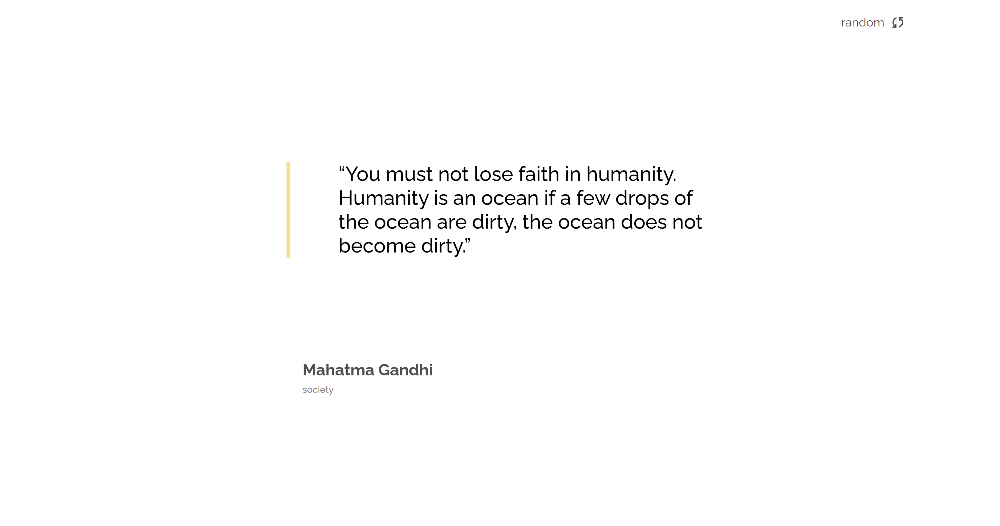

<h1 align="center">Quote Generator using React and Tailwind</h1>

<div align="center">
   Solution for a challenge from  <a href="https://legacy.devchallenges.io/paths/front-end-developer" target="_blank">Devchallenges.io</a>.
</div>

<div align="center">
  <h3>
    <a href="https://quote-generator-indol-sigma.vercel.app/">
      Demo
    </a>
    <span> | </span>
    <a href="https://github.com/ShrutiShinde418/quote-generator">
      Solution
    </a>
    <span> | </span>
    <a href="https://legacy.devchallenges.io/challenges/8Y3J4ucAMQpSnYTwwWW8">
      Challenge
    </a>
  </h3>
</div>

<!-- TABLE OF CONTENTS -->

## Table of Contents

- [Table of Contents](#table-of-contents)
- [Overview](#overview)
  - [Built With](#built-with)
- [How To Use](#how-to-use)
- [Acknowledgements](#acknowledgements)
- [Contact](#contact)

<!-- OVERVIEW -->

## Overview




- I learnt how to use the useContext hook and fetching data from an API during the course of this project.

### Built With

- [React](https://reactjs.org/)
- [Tailwind](https://tailwindcss.com/)

## How To Use

To clone and run this application, you'll need [Git](https://git-scm.com) and [Node.js](https://nodejs.org/en/download/) (which comes with [npm](http://npmjs.com)) installed on your computer. From your command line:

```bash
# Clone this repository
$ git clone https://github.com/ShrutiShinde418/quote-generator

# Install dependencies
$ npm install

# Run the app
$ npm start
```

## Acknowledgements

- [A Guide to React Context and useContext() Hook](https://dmitripavlutin.com/react-context-and-usecontext/)

## Contact

- Website [Portfolio](https://portfolio-devchallenges-henna.vercel.app/)
- GitHub [@ShrutiShinde418](https://github.com/ShrutiShinde418)